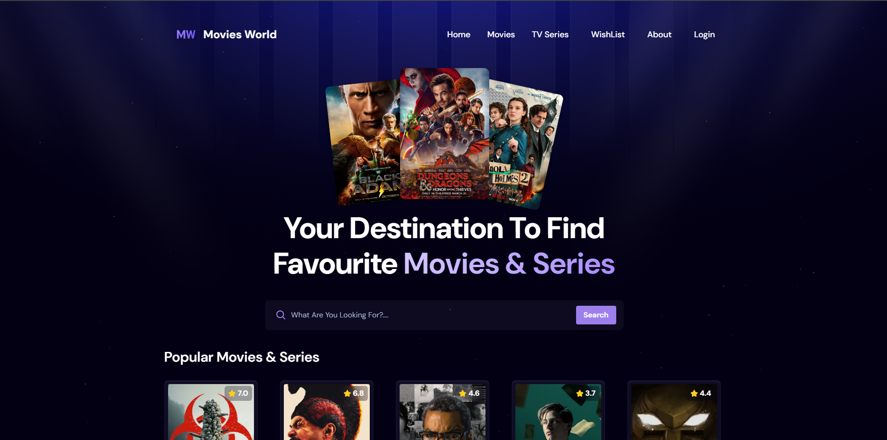

# 🎥 Movie World

Welcome to **Movie World** – a modern movie browsing platform that allows users to explore trending movies and series, manage wishlists, and enjoy a seamless movie discovery experience.

## 🌐 Live
[View](https://infomoviesworld.vercel.app/)



---

## 🔥 Features

- 🔍 Search for movies and TV shows  
- 📺 View trending and popular movies/series  
- ❤️ Add/remove movies to/from your wishlist  
- 🔐 Protected routes using Firebase Auth  
- 📱 Fully responsive and accessible UI  
- 🎨 Shiny, animated text and clean visuals  
- 📤 Email verification, forgot password, and OTP login (Firebase)  
- 🌙 Dark/light theme ready (optional)

---

## 🧰 Tech Stack

| Category        | Tech Used                                                      |
|----------------|-----------------------------------------------------------------|
| 🧑‍💻 Frontend      | [React.js](https://reactjs.org/) + [Vite](https://vitejs.dev/)|
| 🌐 Routing       | [React Router DOM](https://reactrouter.com/)                  |
| 🎨 Styling       | [Tailwind CSS](https://tailwindcss.com/)                      |
| 🔐 Auth          | Firebase Authentication + OTP Login                           |
| 📦 Backend API   | [Appwrite](https://appwrite.io/)                              |
| 📁 State Mgmt    | React useState/useEffect                                      |
| 🍿 Data          | TMDb API (The Movie Database) or similar                      |
| 🚀 Deployment    | [Vercel](https://vercel.com/)                                 |

---

## 📁 Folder Structure (Simplified)

```

movies\_world/
├── public/
│   └── moviesworld.png      # Banner image
├── src/
│   ├── api/                 # API logic (e.g., TMDb functions)
│   ├── assets/              # Static assets like logos
│   ├── components/
│   │   ├── Layout/          # App layout (header, footer)
│   │   ├── Ui/              # Reusable UI components
│   │   │   ├── Movies/      # Movie cards, lists
│   │   │   └── TvSeries/    # TV-specific components
│   ├── pages/               # Route pages (home, login, signup, etc.)
│   ├── App.jsx              # Main app component
│   ├── firebase.js          # Firebase config
│   ├── appwrite.js          # Appwrite config (if used)
├── .env.example             # Environment variables template
├── vite.config.js
└── README.md

```

---

## 🚀 Getting Started

### 1. Clone the Repository

```bash
git clone https://github.com/jaimin-acharya/movies_world.git
cd movies_world
````

### 2. Install Dependencies

```bash
npm install
# or
yarn
```

### 3. Configure Environment Variables

Create a `.env` file and add your Firebase, Appwrite, and TMDb API keys:

```env
# TMDB API
VITE_TMDB_API_KEY=YOUR_API_KEY

# APPWRITE
VITE_APPWRITE_PROJECT_ID=YOUR_PROJECT_ID
VITE_APPWRITE_DATABASE_ID=YOUR_DATABASE_ID
VITE_APPWRITE_COLLECTION_ID=YOUR_COLLECTION_ID

# FIREBASE
VITE_FIREBASE_API_KEY=YOUR_FIREBASE_API_KEY
VITE_FIREBASE_DOMAIN=YOUR_FIREBASE_DOMAIN
VITE_FIREBASE_PROJECT_ID=YOUR_FIREBASE_PROJECT_ID
VITE_FIREBASE_APP_ID=YOUR_FIREBASE_APP_ID
```

### 4. Run the App Locally

```bash
npm run dev
```

> App will be live at `http://localhost:5173`

---

## ✅ Usage

* Visit the homepage to see trending movies/series
* Use the search bar to find specific titles
* Sign up/login to add movies to your wishlist
* Navigate through pages like About, Contact, Series, Movies
* Reset password and verify email through Firebase flows

---

## 👨‍💻 Author

**Jaimin Acharya**

* GitHub: [@jaimin-acharya](https://github.com/jaimin-acharya)
* Email: jaiminacharya9@gmail.com
* Portfolio: [porfolio](https://jaiminacharya.vercel.app)

---

## 📜 License

This project is licensed under the **MIT License** – see the [LICENSE](./LICENSE) file for details.

---

### 🌐 Live Demo

[Vercel](https://infomoviesworld.vercel.app/)

---

Made with ❤️ using React, Vite, Firebase & Tailwind CSS


